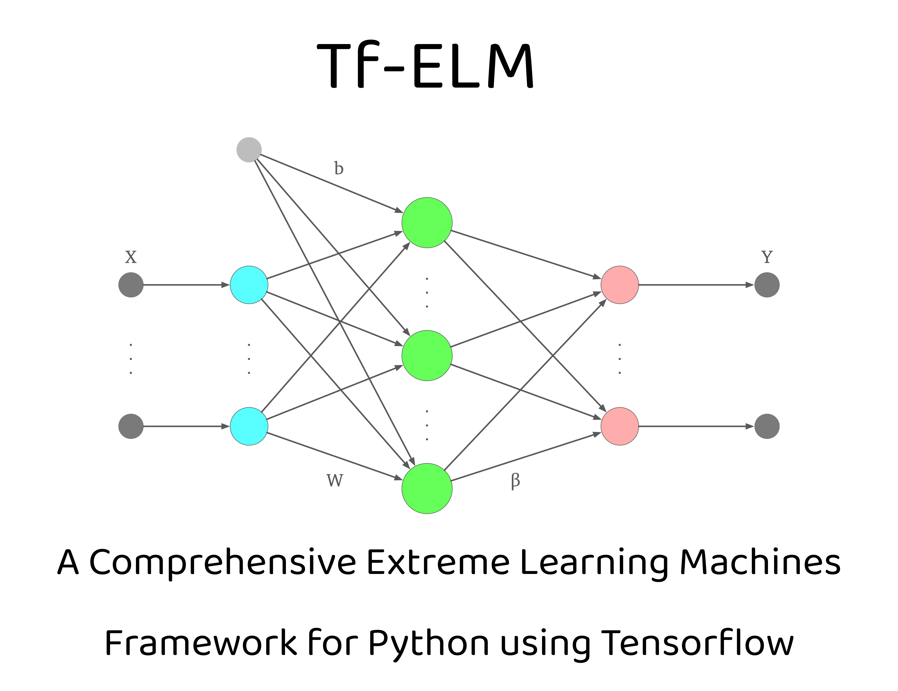

# TfELM : Extreme Learning Machines Framework with Python and TensorFlow

This framework provides a comprehensive set of tools and utilities for implementing and experimenting with Extreme Learning Machines using Python and TensorFlow. ELMs are a type of machine learning algorithm known for their simplicity, efficiency, and scalability, making them ideal for various applications, including classification, regression, and feature learning tasks.



## Table of Contents

- [Introduction](#introduction)
- [Features](#features)
- [Documentation](#documentation)
- [Installation](#installation)
- [Usage](#usage)
- [Examples](#examples)
- [License](#license)

## Introduction

Extreme Learning Machines (ELMs) represent a class of feedforward neural networks initially proposed by Huang et al. in 2006. Traditional neural networks typically involve iterative optimization methods to learn both input weights and hidden layer biases, leading to computationally intensive training processes. In contrast, ELMs revolutionize this paradigm by adopting a simplified approach where input weights and biases are randomly initialized, and only the output weights are learned through a single linear regression. This architectural choice not only drastically reduces training time but also alleviates computational complexity, rendering ELMs highly efficient for tackling large-scale problems.

### Basic Extreme Learning Machine concept

Let's denote the input data matrix as $`X`$ 
of size $`N \times M`$, where $`N`$ represents the 
number of samples and $`M`$ denotes the number of features. 
The hidden layer of an ELM consists of $`K`$ 
hidden neurons with random input weights 
$`W`$ of size $`M \times K`$
and biases $`b`$ of size $`1 \times K`$. 
The output weights $`beta`$ are learned through a 
linear regression approach. Given the activation function 
$`g(\cdot)`$, the output of the hidden layer can be computed as:

$`H = g(X\mathbf{W} + \mathbf{b})`$

Where $`H`$ is the hidden layer output matrix of size 
$`N \times K`$. The output weights $`beta`$ 
can then be determined by solving the linear regression problem:

$`beta = (H^TH)^{-1}H^TY `$

Where $`Y`$ is the target output matrix of size $`N \times L`$,
with $`L`$ representing the number of output neurons.

### Framework Overview

This repository offers a versatile and user-friendly framework for implementing and experimenting with ELMs using Python and TensorFlow. Researchers and practitioners alike can leverage this framework to explore novel machine learning techniques or seek efficient solutions to real-world problems. With its powerful toolkit for building and evaluating ELM models, this repository aims to facilitate seamless experimentation and deployment of ELM-based solutions across various domains.

### Scarcity of ELM Implementations and the Need for a Comprehensive Framework

Despite the effectiveness and efficiency of Extreme Learning Machines (ELMs), there is a noticeable scarcity of comprehensive implementations in the machine learning community. Existing implementations are often fragmented, with individual researchers providing standalone implementations tailored to specific research papers. These implementations lack the versatility required for broader applications and may not always be reliable, with some failing to produce accurate results. Moreover, many existing implementations are solely available in MATLAB, restricting accessibility and hindering collaboration in the open-source community.

To address these limitations, this framework fills a crucial gap by providing a comprehensive and user-friendly toolkit for implementing and experimenting with ELMs using Python and TensorFlow. Leveraging TensorFlow for computation offers several advantages, including the ability to harness the power of GPUs for accelerated training. TensorFlow's efficient GPU utilization significantly speeds up computation, making it ideal for handling large-scale datasets and computationally intensive tasks. Additionally, the framework supports both GPU and CPU execution, ensuring compatibility with various computing environments.

Furthermore, the framework facilitates model persistence by enabling users to save and load ELM models using the standard HDF5 format provided by TensorFlow. This feature ensures seamless model deployment and sharing, allowing researchers and practitioners to collaborate and build upon each other's work effectively.

## Features
### Overview
- **Comprehensive Framework**: In response to the scarcity of comprehensive implementations for Extreme Learning Machines (ELMs), this framework provides a robust and all-encompassing solution. Unlike fragmented implementations scattered across various research papers, this framework offers a unified toolkit tailored for versatile applications.
- **Efficient Training with TensorFlow**: Harnessing the power of TensorFlow, the framework ensures efficient training of ELM models. TensorFlow's GPU acceleration significantly speeds up computation, making it suitable for handling large-scale datasets and time-sensitive applications. Moreover, the framework supports both GPU and CPU execution, ensuring compatibility with diverse computing environments.
- **Versatile Applications**: ELMs are renowned for their versatility, capable of tackling a wide range of machine learning tasks, including classification, regression, and feature learning. With this framework, users can effortlessly apply ELMs to various real-world problems, thanks to its user-friendly interface and extensive functionalities.
- **Model Persistence and Portability**: The framework enables seamless model persistence by allowing users to save and load ELM models using the standard HDF5 format provided by TensorFlow. This feature facilitates model deployment, sharing, and collaboration, empowering researchers and practitioners to build upon each other's work effectively.
- **Modular Design and Extensibility**: Designed with a modular architecture, the framework empowers users to customize and extend various components of the ELM model effortlessly. This flexibility ensures adaptability to diverse research requirements and facilitates the integration of novel techniques and algorithms.
- **Comprehensive Documentation and Examples**: Detailed documentation and usage examples accompany the framework, providing users with comprehensive guidance on understanding and implementing ELMs. These resources facilitate rapid onboarding and empower users to leverage the full potential of the framework in their research and applications.
### Implemented Variants of Extreme Learning Machines

1. **Basic Extreme Learning Machine (ELM)**:
    - Implementation with 108 various activation functions available for regression and classification tasks. Integration with scikit-learn functions like cross_val_score for straightforward accessibility.

2. **Constrained Extreme Learning Machine (CELM)**:
    - Specifically designed for imbalanced datasets, generates weights based on class differences in the input data rather than random initialization.

3. **Deep Extreme Learning Machine (DeepELM)**:
    - Incorporates multiple layers, with each layer consisting of a type of ELM layer, enabling deep learning capabilities.

4. **Deep Representation Extreme Learning Machine (DrELM)**:
    - Utilizes random projection on input data, followed by shift and kernel function application to obtain beta, forming a block that can be stacked together for multilayer architecture.

5. **Enhanced Deep Representation Extreme Learning Machine (EHDrELM)**:
    - Incorporates skip connections from residual networks to consider the output of preceding blocks in calculating shifted mapping.

6. **Graph Regularized Extreme Learning Machine Autoencoder (GELM-AE)**:
    - Learns feature representation through unsupervised learning using the regularized Graph Laplacian concept.

7. **Kernel Extreme Learning Machine (KELM)**:
    - Utilizes Mercer Kernels to generate hidden layer output without defining the number of neurons, with support for various kernel functions and kernel matrix approximations using the Nystrom method.

8. **Local Receptive Field Extreme Learning Machine (LRF-ELM)**:
    - Implements randomly generated convolutional hidden nodes for feature mapping, suitable for classification tasks.

9. **Metaheuristic Algorithms for Extreme Learning Machine Optimization (MA-ELM)**:
    - Optimizes random weights for specific tasks using Metaheuristic Algorithms from the comprehensive mealpy package, enabling efficient population-based metaheuristic optimization.

10. **Multi-layer Extreme Learning Machine (ML-ELM)**:
    - Consists of multiple layers of ELM units (AE-ELM) for feature extraction followed by a final ELM layer for classification, adaptable to various layer configurations.

11. **Online Sequential Extreme Learning Machine (OS-ELM)**:
    - Utilizes the Woodbury matrix identity concept for incremental learning chunk-by-chunk of data.

12. **Regularized Extreme Learning Machine (RELM)**:
    - Applies regularization parameter optimization, with support for optimizing l1, l2, or combined norms using optimizers like FISTA, ISTA, LGFGBS, and PGD.

13. **Receptive Fields Extreme Learning Machine (RF-ELM)**:
    - Randomly generates random fields on top of randomly generated input weights in ELM, enhancing feature representation.

14. **Residual Compensation Extreme Learning Machine (RC-ELM)**:
    - Residual version of ELM designed for regression tasks, incorporating residual learning techniques.

15. **Semi-Supervised Extreme Learning Machine (SS-ELM)**:
    - Suitable for tasks with labeled and unlabeled data, featuring custom methods for dataset splitting and evaluation.

16. **Subnetwork Extreme Learning Machine (SubELM)**:
    - Implements the SubELM algorithm, dividing the input space into subspaces and learning separate subnetworks for each subspace using random feature mapping and activation functions.

17. **Unsupervised Extreme Learning Machine (US-ELM)**:
    - Designed for unsupervised tasks like data embedding or clustering, leveraging ELM's capabilities for unsupervised learning.

18. **Weighted Extreme Learning Machine (WELM)**:
    - Incorporates weighted samples during training using methods like 'wei-1', 'wei-2', 'ban-1', 'ban-decay'.

For all the mentioned methods, there is support for saving and loading mechanisms using HDF5 format. Additionally, they are compatible with cross_val_score, providing both predict and predict_proba functionalities for ROC/AUC curve calculations. Each algorithm runs on TensorFlow, ensuring efficient computation and compatibility with various computing environments.

## Documentation
[Documentation](https://tfelm.readthedocs.io/index.html](https://kstruniawski.github.io/TfELM/) is available at the provided link.

## Installation

To install the ELM Framework, simply clone this repository to your local machine:

```bash
git clone https://github.com/yourusername/elm-framework.git
```
Then, navigate to the cloned directory and install the required dependencies using pip:
```bash
cd elm-framework
pip install -r requirements.txt
```

## Usage

In this package, the folder structure is organized to facilitate easy navigation and utilization of different components. The **Data** folder contains exemplary datasets sourced from UCI, providing users with readily available data for experimentation. Within the **Examples** directory, users can find sample code demonstrating the application of various Extreme Learning Machine (ELM) methods. The **Layers** folder houses ELM layers, which can be directly employed or, preferably, utilized through the **Models** directory. The Models directory is structured following well-established patterns, facilitating usage through familiar fit/predict/predict_proba methods. Additionally, integration with scikit-learn functions like cross_val_score for cross-validated data is supported. The **Optimisers** folder contains optimizers such as the MA optimizer or optimizers for applying l1/l2 norms in Regularized ELM (RELM). Lastly, the **Resources** directory contains various additional scripts that support the functionality of the entire package. This organized structure aims to streamline the process of accessing and utilizing different components of the ELM package.

To utilize the ELM Framework, follow these steps in your Python code:
```pythoncode
import numpy as np
import pandas as pd
from sklearn.metrics import accuracy_score
from sklearn.model_selection import RepeatedKFold, cross_val_score
from sklearn.preprocessing import LabelEncoder
from sklearn import preprocessing

from Layers.ELMLayer import ELMLayer
from Models.ELMModel import ELMModel


# Hyperparameters:
num_neurons = 1000
n_splits = 10
n_repeats = 50

# Loading sample dataset from Data folder
path = "../Data/ionosphere.txt"
df = pd.read_csv(path, delimiter='\t').fillna(0)
X = df.values[:, 1:]
y = df.values[:, 0]

# Label encoding and features normalization
label_encoder = LabelEncoder()
y = label_encoder.fit_transform(y)  # Encode class labels to numerical values
X = preprocessing.normalize(X)  # Normalize feature vectors

# Initialize an Extreme Learning Machine (ELM) layer
elm = ELMLayer(number_neurons=num_neurons, activation='mish')

# Create an ELM model using the trained ELM layer
model = ELMModel(elm)

# Define a cross-validation strategy
cv = RepeatedKFold(n_splits=n_splits, n_repeats=n_repeats)

# Perform cross-validation to evaluate the model performance
scores = cross_val_score(model, X, y, cv=cv, scoring='accuracy', error_score='raise')

# Print the mean accuracy score obtained from cross-validation
print(np.mean(scores))

# Fit the ELM model to the entire dataset
model.fit(X, y)

# Save the trained model to a file
model.save("Saved Models/ELM_Model.h5")

# Load the saved model from the file
model = model.load("Saved Models/ELM_Model.h5")

# Evaluate the accuracy of the model on the training data
acc = accuracy_score(model.predict(X), y)
print(acc)
```
For more detailed usage instructions and examples, refer to the documentation and examples provided in the repository.

## Examples
The examples directory contains various usage examples demonstrating how to use the ELM Framework for different machine learning tasks, including classification, regression, and feature learning.

To run the examples, simply navigate to the desired example directory and execute the Python script:
```bash
cd Examples
python ELM.py
```

## Sample datasets
This repository utilizes sample datasets sourced from the UCI Machine Learning Repository.

## License
Shield: [![CC BY-NC 4.0][cc-by-nc-sa-shield]][cc-by-nc-sa]

This work is licensed under a
[Creative Commons Attribution-NonCommercial-ShareAlike 4.0 International License][cc-by-nc-sa].

[![CC BY-NC-SA 4.0][cc-by-nc-sa-image]][cc-by-nc-sa]

[cc-by-nc-sa]: http://creativecommons.org/licenses/by-nc-sa/4.0/
[cc-by-nc-sa-image]: https://licensebuttons.net/l/by-nc-sa/4.0/88x31.png
[cc-by-nc-sa-shield]: https://img.shields.io/badge/License-CC%20BY--NC--SA%204.0-lightgrey.svg
